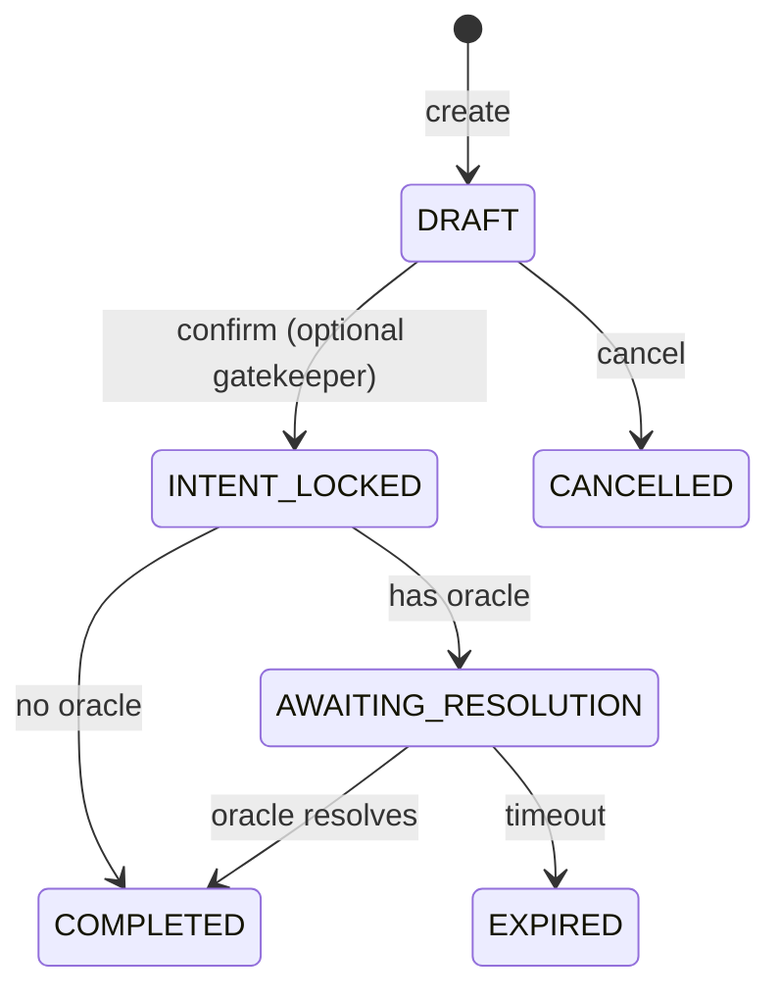
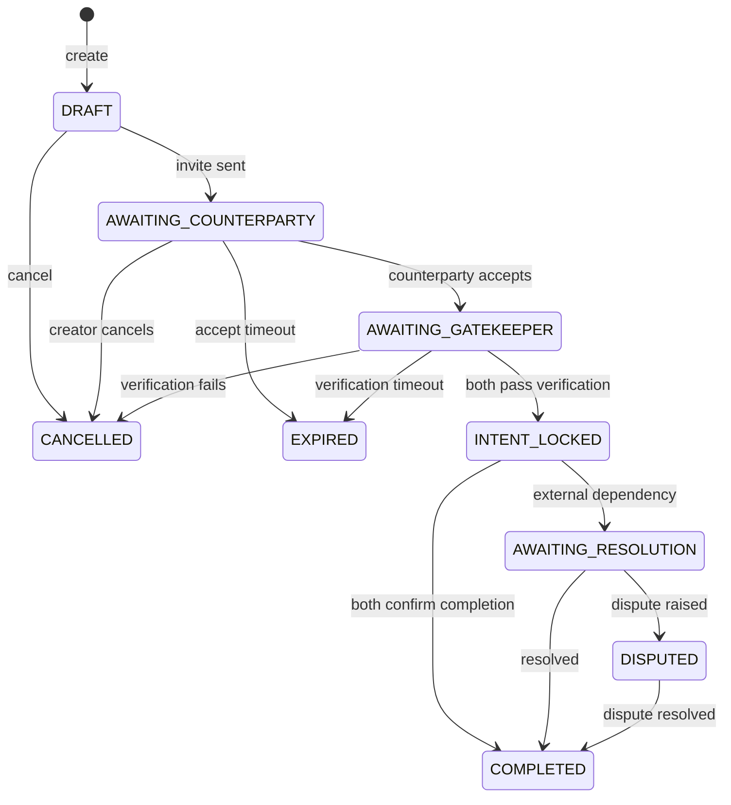
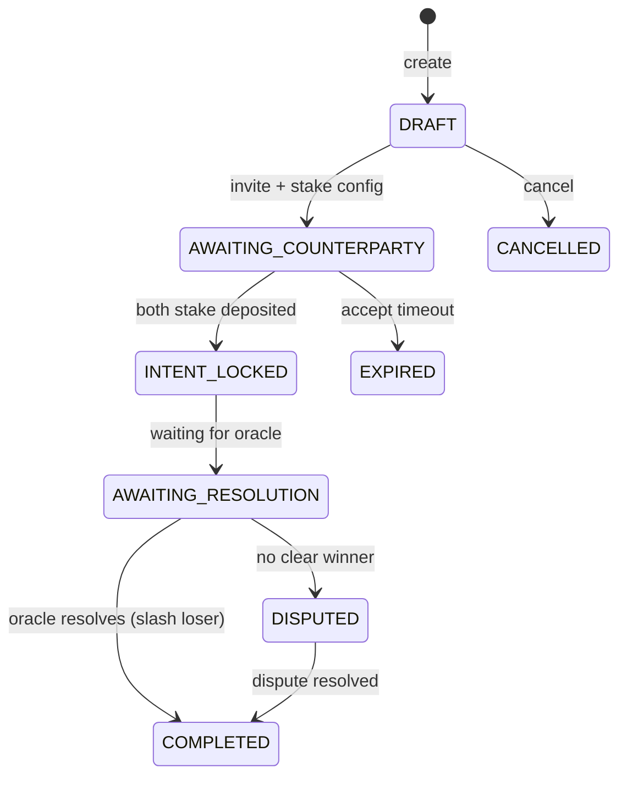
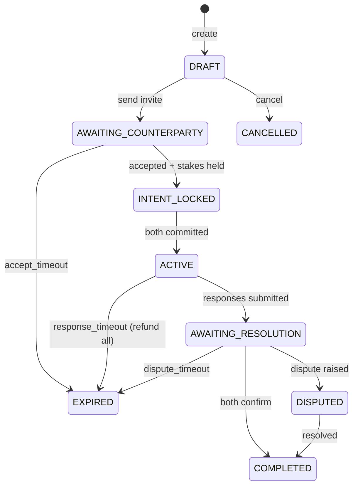

# State Machines

> Mode lifecycle diagrams and transition rules.  
> Every state change must follow these defined paths.

---

## Challenge Status Enum

```typescript
type ChallengeStatus =
  | 'DRAFT'                    // Creator configuring
  | 'AWAITING_COUNTERPARTY'    // Waiting for acceptance
  | 'AWAITING_GATEKEEPER'      // Verification in progress
  | 'INTENT_LOCKED'            // Both parties committed
  | 'ACTIVE'                   // Ongoing (time-based modes)
  | 'AWAITING_RESOLUTION'      // Waiting for outcome
  | 'COMPLETED'                // Successfully resolved
  | 'CANCELLED'                // Cancelled by party
  | 'EXPIRED'                  // Timed out
  | 'DISPUTED';                // Under dispute
```

---

## Solo Mode

**Purpose:** Single user creates an attestation or self-check.



**Transitions:**

| From | To | Trigger | Condition |
|------|-----|---------|-----------|
| DRAFT | INTENT_LOCKED | User confirms | Gatekeeper passes (if configured) |
| DRAFT | CANCELLED | User cancels | — |
| INTENT_LOCKED | AWAITING_RESOLUTION | Auto | Has oracle requirement |
| INTENT_LOCKED | COMPLETED | Auto | No oracle, immediate attestation |
| AWAITING_RESOLUTION | COMPLETED | Oracle data | Resolution received |
| AWAITING_RESOLUTION | EXPIRED | Timeout | Past `resolution_due_at` |

**Code:**

```typescript
// src/modes/solo.ts

import type { Challenge, ChallengeStatus } from '../types';

const SOLO_TRANSITIONS: Record<ChallengeStatus, ChallengeStatus[]> = {
  DRAFT: ['INTENT_LOCKED', 'CANCELLED'],
  INTENT_LOCKED: ['AWAITING_RESOLUTION', 'COMPLETED'],
  AWAITING_RESOLUTION: ['COMPLETED', 'EXPIRED'],
  COMPLETED: [],
  CANCELLED: [],
  EXPIRED: [],
  // Not used in SOLO mode
  AWAITING_COUNTERPARTY: [],
  AWAITING_GATEKEEPER: [],
  ACTIVE: [],
  DISPUTED: [],
};

export function canTransitionSolo(
  from: ChallengeStatus,
  to: ChallengeStatus
): boolean {
  return SOLO_TRANSITIONS[from]?.includes(to) ?? false;
}

export function getNextStatusSolo(challenge: Challenge): ChallengeStatus {
  switch (challenge.status) {
    case 'DRAFT':
      return 'INTENT_LOCKED';
    case 'INTENT_LOCKED':
      return challenge.resolution_due_at ? 'AWAITING_RESOLUTION' : 'COMPLETED';
    case 'AWAITING_RESOLUTION':
      return 'COMPLETED';
    default:
      throw new Error(`No automatic transition from ${challenge.status}`);
  }
}
```

---

## Gatekeeper Mode

**Purpose:** Both parties verify wallet ownership and funds before intent lock.



**Verification happens:** After both sides accept terms, BEFORE `intent_locked_at`.

**Transitions:**

| From | To | Trigger | Condition |
|------|-----|---------|-----------|
| DRAFT | AWAITING_COUNTERPARTY | Creator sends invite | — |
| AWAITING_COUNTERPARTY | AWAITING_GATEKEEPER | Counterparty accepts | Within accept timeout |
| AWAITING_GATEKEEPER | INTENT_LOCKED | Both pass | Wallet + funds verified |
| AWAITING_GATEKEEPER | CANCELLED | Either fails | Verification fails |
| INTENT_LOCKED | COMPLETED | Both confirm | Transaction complete |
| INTENT_LOCKED | DISPUTED | Either raises | Within dispute window |

**Code:**

```typescript
// src/modes/gatekeeper.ts

import type { Challenge, ChallengeStatus } from '../types';

const GATEKEEPER_TRANSITIONS: Record<ChallengeStatus, ChallengeStatus[]> = {
  DRAFT: ['AWAITING_COUNTERPARTY', 'CANCELLED'],
  AWAITING_COUNTERPARTY: ['AWAITING_GATEKEEPER', 'EXPIRED', 'CANCELLED'],
  AWAITING_GATEKEEPER: ['INTENT_LOCKED', 'CANCELLED', 'EXPIRED'],
  INTENT_LOCKED: ['AWAITING_RESOLUTION', 'COMPLETED', 'DISPUTED'],
  AWAITING_RESOLUTION: ['COMPLETED', 'DISPUTED', 'EXPIRED'],
  DISPUTED: ['COMPLETED'],
  COMPLETED: [],
  CANCELLED: [],
  EXPIRED: [],
  ACTIVE: [],
};

export function canTransitionGatekeeper(
  from: ChallengeStatus,
  to: ChallengeStatus
): boolean {
  return GATEKEEPER_TRANSITIONS[from]?.includes(to) ?? false;
}

export interface GatekeeperVerificationResult {
  creatorWalletVerified: boolean;
  creatorFundsVerified: boolean;
  counterpartyWalletVerified: boolean;
  counterpartyFundsVerified: boolean;
}

export function shouldLockIntent(result: GatekeeperVerificationResult): boolean {
  return (
    result.creatorWalletVerified &&
    result.creatorFundsVerified &&
    result.counterpartyWalletVerified &&
    result.counterpartyFundsVerified
  );
}
```

---

## Fire Mode

**Purpose:** Both stake honesty bonds; loser may be slashed.



**Slash Logic:**

| Outcome | Winner | Loser | Treasury | Burn |
|---------|--------|-------|----------|------|
| CREATOR_WIN | Gets base + bond back | Loses bond | 10% of loser bond | 30% of loser bond |
| COUNTERPARTY_WIN | Gets base + bond back | Loses bond | 10% of loser bond | 30% of loser bond |
| DRAW | Both refunded | — | — | — |
| NO_CONTEST | Both refunded | — | — | — |

**Code:**

```typescript
// src/modes/fire.ts

import type { Challenge, ChallengeStatus, Stake } from '../types';

const FIRE_TRANSITIONS: Record<ChallengeStatus, ChallengeStatus[]> = {
  DRAFT: ['AWAITING_COUNTERPARTY', 'CANCELLED'],
  AWAITING_COUNTERPARTY: ['INTENT_LOCKED', 'EXPIRED', 'CANCELLED'],
  INTENT_LOCKED: ['AWAITING_RESOLUTION'],
  AWAITING_RESOLUTION: ['COMPLETED', 'DISPUTED'],
  DISPUTED: ['COMPLETED'],
  COMPLETED: [],
  CANCELLED: [],
  EXPIRED: [],
  AWAITING_GATEKEEPER: [],
  ACTIVE: [],
};

export type Outcome = 'CREATOR_WIN' | 'COUNTERPARTY_WIN' | 'DRAW' | 'NO_CONTEST';

export interface SlashDistribution {
  winner: {
    base: string;
    bond: string;
    reward: string;  // From loser's bond
  };
  loser: {
    base: string;    // Returned
    bond: string;    // Slashed
  };
  treasury: string;  // 10% of slashed bond
  burn: string;      // 30% of slashed bond
  provers: string;   // 10% of slashed bond (future)
  challenger: string; // 50% of slashed bond
}

export function calculateSlashDistribution(
  outcome: Outcome,
  creatorStakes: Stake[],
  counterpartyStakes: Stake[]
): SlashDistribution | null {
  if (outcome === 'DRAW' || outcome === 'NO_CONTEST') {
    return null; // Full refund, no slashing
  }
  
  const loserStakes = outcome === 'CREATOR_WIN' 
    ? counterpartyStakes 
    : creatorStakes;
  
  const loserBond = loserStakes.find(s => s.type === 'HONESTY_BOND');
  if (!loserBond) return null;
  
  const bondAmount = BigInt(loserBond.amount);
  
  return {
    winner: {
      base: '0', // Calculated separately
      bond: '0', // Returned in full
      reward: (bondAmount * 50n / 100n).toString(), // 50% of loser bond
    },
    loser: {
      base: '0', // Returned
      bond: loserBond.amount, // Fully slashed
    },
    treasury: (bondAmount * 10n / 100n).toString(),
    burn: (bondAmount * 30n / 100n).toString(),
    provers: (bondAmount * 10n / 100n).toString(),
    challenger: (bondAmount * 50n / 100n).toString(),
  };
}
```

---

## Enforced Mode

**Purpose:** Bilateral required responses with timeouts and automatic refunds.



**Timeout Rules (User-Configurable):**

| Timeout | Default | Min | Max | On Expiry |
|---------|---------|-----|-----|-----------|
| `accept_timeout` | 15 min | 1 min | 7 days | EXPIRED, no stakes taken |
| `response_timeout` | 24 hours | 5 min | 30 days | EXPIRED, full refund |
| `dispute_timeout` | 72 hours | 1 hour | 30 days | COMPLETED per original outcome |

**Code:**

```typescript
// src/modes/enforced.ts

import type { Challenge, ChallengeStatus } from '../types';

const ENFORCED_TRANSITIONS: Record<ChallengeStatus, ChallengeStatus[]> = {
  DRAFT: ['AWAITING_COUNTERPARTY', 'CANCELLED'],
  AWAITING_COUNTERPARTY: ['INTENT_LOCKED', 'EXPIRED', 'CANCELLED'],
  INTENT_LOCKED: ['ACTIVE', 'EXPIRED'],
  ACTIVE: ['AWAITING_RESOLUTION', 'EXPIRED'],
  AWAITING_RESOLUTION: ['COMPLETED', 'DISPUTED', 'EXPIRED'],
  DISPUTED: ['COMPLETED'],
  COMPLETED: [],
  CANCELLED: [],
  EXPIRED: [],
  AWAITING_GATEKEEPER: [],
};

export interface EnforcedConfig {
  accept_timeout_seconds: number;
  response_timeout_seconds: number;
  dispute_timeout_seconds: number;
}

export const DEFAULT_ENFORCED_CONFIG: EnforcedConfig = {
  accept_timeout_seconds: 900,      // 15 minutes
  response_timeout_seconds: 86400,  // 24 hours
  dispute_timeout_seconds: 259200,  // 72 hours
};

export function getTimeoutForStatus(
  status: ChallengeStatus,
  config: EnforcedConfig
): number {
  switch (status) {
    case 'AWAITING_COUNTERPARTY':
      return config.accept_timeout_seconds;
    case 'INTENT_LOCKED':
    case 'ACTIVE':
      return config.response_timeout_seconds;
    case 'DISPUTED':
      return config.dispute_timeout_seconds;
    default:
      return 0;
  }
}

export function shouldRefundOnTimeout(status: ChallengeStatus): boolean {
  // Timeout before binding commitment = full refund
  return ['AWAITING_COUNTERPARTY', 'INTENT_LOCKED', 'ACTIVE'].includes(status);
}
```

---

## Shared Transition Logic

```typescript
// src/modes/transitions.ts

import type { Challenge, ChallengeStatus, ChallengeMode } from '../types';
import { canTransitionSolo } from './solo';
import { canTransitionGatekeeper } from './gatekeeper';
import { canTransitionFire } from './fire';
import { canTransitionEnforced } from './enforced';

export function canTransition(
  mode: ChallengeMode,
  from: ChallengeStatus,
  to: ChallengeStatus
): boolean {
  switch (mode) {
    case 'SOLO':
      return canTransitionSolo(from, to);
    case 'GATEKEEPER':
      return canTransitionGatekeeper(from, to);
    case 'FIRE':
      return canTransitionFire(from, to);
    case 'ENFORCED':
      return canTransitionEnforced(from, to);
    default:
      return false;
  }
}

export function validateTransition(
  challenge: Challenge,
  newStatus: ChallengeStatus
): { valid: boolean; error?: string } {
  if (!canTransition(challenge.mode, challenge.status, newStatus)) {
    return {
      valid: false,
      error: `Invalid transition: ${challenge.mode} cannot go from ${challenge.status} to ${newStatus}`,
    };
  }
  return { valid: true };
}

export function isTerminalStatus(status: ChallengeStatus): boolean {
  return ['COMPLETED', 'CANCELLED', 'EXPIRED'].includes(status);
}

export function requiresCounterparty(mode: ChallengeMode): boolean {
  return mode !== 'SOLO';
}
```

---

## Cron Job: Timeout Checker

```typescript
// src/jobs/timeout-checker.ts

import type { Env } from '../types';
import { query, execute } from '../db';

export async function checkTimeouts(env: Env): Promise<void> {
  const now = new Date().toISOString();
  
  // Find challenges past their timeout
  const expiring = await query(
    env.TATTLEHASH_DB,
    `SELECT * FROM challenges 
     WHERE status NOT IN ('COMPLETED', 'CANCELLED', 'EXPIRED')
     AND expires_at IS NOT NULL
     AND expires_at < ?`,
    [now]
  );
  
  for (const challenge of expiring) {
    await expireChallenge(env, challenge);
  }
}

async function expireChallenge(env: Env, challenge: Challenge): Promise<void> {
  // Update status
  await execute(
    env.TATTLEHASH_DB,
    `UPDATE challenges SET status = 'EXPIRED', updated_at = ? WHERE id = ?`,
    [new Date().toISOString(), challenge.id]
  );
  
  // Refund stakes if applicable
  if (shouldRefundOnTimeout(challenge.status)) {
    await refundAllStakes(env, challenge.id);
  }
  
  // Emit event
  await emitEvent(env, {
    type: 'challenge.timeout_expired',
    challenge_id: challenge.id,
  });
}
```
